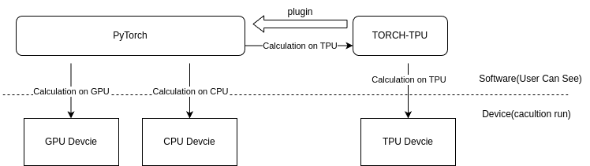

TORCH-TPU简介
============

TORCH-TPU是算能为了支持深度学习框架PyTorch而建立的工程项目。该工程期望利用PyTorch的原始API即使用算能的设备。

部分使用的示例已经放到github: https://github.com/sophgo/torch-tpu , 未来将会进一步开放代码。

TORCH-TPU的原理如下:

   TORCH-TPU原理

TORCH-TPU作为PyTorch的一个插件存在，当PyTorch调用一个计算时，会根据数据的设备类型来调用不同设备进行计算。

PyTorch默认可以调用GPU、CPU进行计算。当PyTorch需要调用TPU进行计算时，PyTorch会在自身框架内完成相关逻辑的控制，将计算具体实现放置到TORCH-TPU来完成。

本文详细描述实现细节, 用于指导开发。
