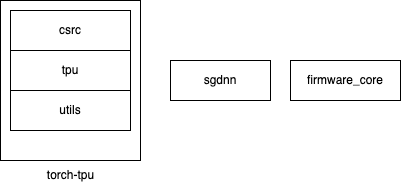
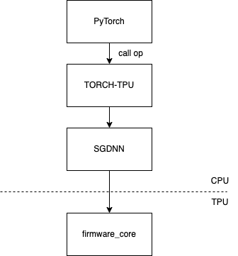

TORCH-TPU总体架构设计介绍
========

本章介绍 TORCH-TPU的总体设计。

TORCH-TPU总体架构设计
--------------------

TORCH-TPU使用Pytorch的第三方设备扩展支持方式，使用Python和C++两种语言的开发。

其中Python部分主要是对C++后端代码的绑定，实现对原始Pytorch函数的扩展，设备注册和初始化工作。

C++部分主要是对设备内存的管理，相关函数的注册和调用逻辑等。

   代码组织

其中,torch_tpu是Pytorch的接口部分，TPU的软件生态通过sgdnn接入到Pytoch软件中。

sgdnn是对算子的封装，firmware_core是对算子的实现。

TORCH-TPU根据运行时状态区分，TROCH-TPU可以运行于EagerMode和CompileMode两种模式下。

EagerMode即Pytorch的动态图执行模式。在该种模式下，每一次API的调用都会立即执行相应的计算。

CompileMode即Pytorch在2.0版本之后引入的Dynamo执行模式。在该模式下，会先执行编译的动作，将运算编译成芯片可执行的二进制代码再进行计算调用。

两种模式的使用方法，与Pytorch官方使用方法一致，详细不同可以参考后续文档说明。

EagerMode模式
--------------------

EagerMode模式具有灵活性高的优势，可以快速的进行实验和功能验证。

EagerMode模式下，通过Pytorch的Dispatch机制，每次函数调用会根据数据类型以及所属设备分发到不同的算子。

在Pytorch的文件中，标明了算子在不同backend下的分发函数，在TORCH-TPU中为每个算子注册了相应的注册函数。

TORCH-TPU的注册函数最终会通过SGDNN下发给设备，设备端会根据下发kernel算子的参数调用相应的指令进行计算。

kernel算子（又被称为nodechip）是一个c语言写的函数，里面会调用TPU设备的指令执行相应的计算。

在EagerMode下，TPU设备上会有一个MCU处理器来运行这个kernel算子，然后根据这个kernel算子的运算逻辑生产相应的指令写到寄存器当中。

   EagerMode模式

CompileMode模式
--------------------

CompileMode模式具有较高的可扩展性，支持自定义编译器实现模型计算图优化。

CompileMode模式下，通过PyTorch的AOTAutograd功能捕获模型的计算图，并将计算图传入tpu-mlir编译器执行编译优化。

在编译器中，计算图的节点node会被逐一翻译成IR语句，经过一系列的PASS转换，将模型翻译成一个MLIR文件。

MLIR文件最终通过Codegen将IR语句转换为芯片可执行的二进制指令文件bmodel，并把指令下发到TPU设备上完成计算。

