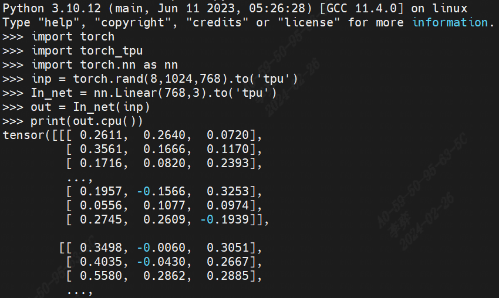
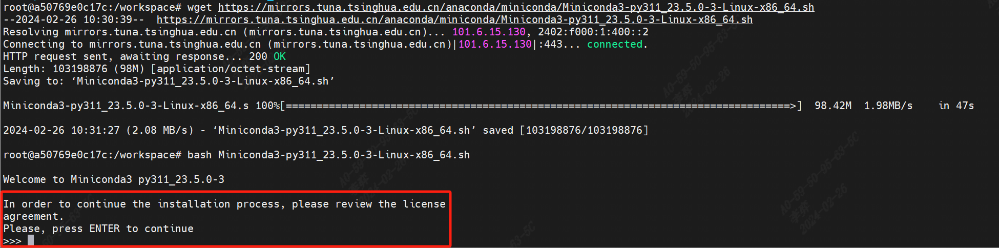
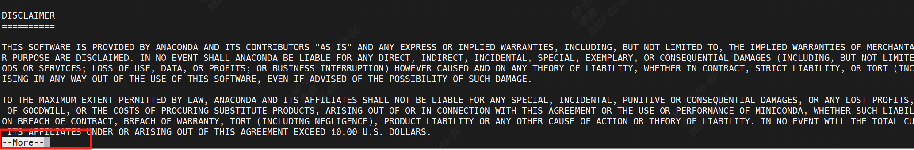
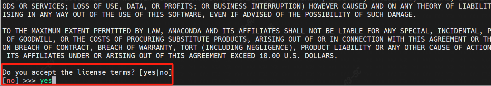
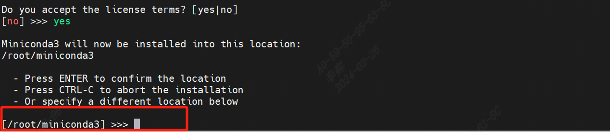
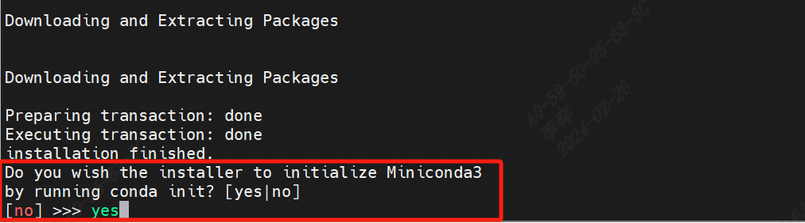

===================
开发环境配置
===================

“torch-tpu”就是算能设备进入PyTorch框架的插件库，是利用了PyTorch的PRIVATEUSEONE后端对算能设备进行的支持。

本章将详细描述如何安装torch_tpu以及其所依赖的环境。

系统环境根据是否使用Docker划分为两种配置方式。若使用非Docker环境，直接跳至
:ref:`非Docker环境配置 <env setup>` ；若使用算能所提供的镜像文件<推荐>，请进行下一节
:ref:`Docker环境配置 <install>`。

.. _install:

Docker环境配置
==================

安装libsophon
------------------

第一步，需要提前安装好libsophon，可以从 https://developer.sophgo.com/site/index/material/41/all.html 下载最新的算能SDK。

然后通过执行下述命令进行安装：

.. code-block:: shell

   # 安装依赖库，只需要执行一次:
   $ sudo apt install dkms libncurses5
   # 安装 libsophon:
   $ sudo dpkg -i sophon-*.deb
   # 在终端执行如下命令，或者登出再登入当前用户后即可使用 bm-smi 等命令:
   $ source /etc/profile

安装过程，如遇到其他问题，可以参考 https://doc.sophgo.com/sdk-docs/v23.07.01/docs_latest_release/docs/libsophon/guide/html/1_install.html 继续进行驱动安装步骤。

安装Docker（首次）
------------------

如果是首次使用Docker, 可执行下述命令进行安装和配置(仅首次执行):

.. code-block:: shell
   
   $ sudo apt install docker.io
   $ sudo systemctl start docker
   $ sudo systemctl enable docker
   $ sudo groupadd docker
   $ sudo usermod -aG docker $USER
   $ newgrp docker

获取镜像
------------------

从 DockerHub https://hub.docker.com/r/sophgo/torch_tpu 下载所需的镜像:

.. code-block:: shell

   $ docker pull sophgo/torch_tpu:v0.1

创建容器
------------------

在使用板卡时，要特别注意：

需要使用–-device将 主机环境下的设备映射到docker容器当中。
需要将/dev/bmdev-ctl也做映射。
将/opt也要映射到容器中的同名路径。（/opt是libsophon的安装路径）。

该步骤目的：建立docker容器，并将host机器映射至docker容器。

创建容器如下：

.. code-block:: shell
  :linenos:

   docker run --cap-add SYS_ADMIN -itd --restart always --privileged \
      -e LD_LIBRARY_PATH=/opt/sophon/libsophon-current/lib:$LD_LIBRARY_PATH \
      -e PATH=/opt/sophon/libsophon-current/bin:$PATH \
      --device=/dev/bmdev-ctl:/dev/bmdev-ctl \
      --device=/dev/bm-sophon0:/dev/bm-sophon0 \
      -v $HOME:/workspace \
      -v /opt:/opt   \
      -w /workspace \
      --name torch_tpu_0 sophgo/torch_tpu:v0.1 bash

   docker attach torch_tpu_0

  # <torch_tpu_0>为自己想要的容器的名字

  # 当前为单机器创建容器示例，如果有多台机器，设备要全部被映射，可按如下格式添加参数：

  #  --device=/dev/bm-sophon0:/dev/bm-sophon0 --device=/dev/bm-sophon7:/dev/bm-sophon1 \
  #      --device=/dev/bm-sophon3:/dev/bm-sophon2 --device=/dev/bm-sophon8:/dev/bm-sophon3

上面命令，将主机的Host路径映射到容器中的/workspace，用户可以按需映射。

后文假定用户已经处于docker里面的/workspace目录。

安装测试
------------------

在docker中，已经安装好了一个torch-tpu。我们可以通过如下python脚本验证是否可用：

.. code-block:: shell

   $ python 
   >> import torch
   >> import torch_tpu
   >> import torch.nn as nn
   >> inp = torch.rand(8,1024,768).to('tpu')
   >> In_net = nn.Linear(768,3).to('tpu')
   >> out = In_net(inp)
   >> print(out.cpu())

若运行正常，且能正常打印 out 参数值（如下图所示），至此，torch-tpu环境配置完成。

需要注意的是，下图示例只截取了一部分输出值，只要能够正常打印出类似的参数值，即可判定为测试正常通过。

若要更新torch-tpu，仅需获取新的torch-tpu包，重新pip install即可。至此，torch-tpu环境配置完成。

.. _env setup:

非Docker环境配置
==================

驱动安装
------------------

首先，需要从 https://developer.sophgo.com/site/index/material/41/all.html 下载最新版本驱动文件。然后依次进行如下步骤：

（1）安装依赖库，执行命令如下：

.. code-block:: shell

   $ sudo apt install dkms libncurses5

（2）安装libsophon：

.. code-block:: shell

   $ sudo dpkg -i sophon-*.deb

（3）在终端执行如下命令，或者登出再登入当前用户后即可使用 bm-smi 等命令：

.. code-block:: shell

   $ source /etc/profile

安装完成后，文件位置为

.. code-block:: shell

   /opt/sophon/
   |—— driver-*.*.*
   |—— libsophon-*.*.*
   │    ├── bin
   │    ├── data
   │    ├── include
   │    └── lib
   └── libsophon-current -> /opt/sophon/libsophon-*.*.*

安装过程，如遇到其他问题，可以参考 https://doc.sophgo.com/sdk-docs/v23.07.01/docs_latest_release/docs/libsophon/guide/html/1_install.html 继续进行驱动安装步骤。

Anaconda安装（可选）
------------------

建议使用Anaconda来进行Python环境的管理，这样可以避免Python环境中各种包的依赖问题。

操作如下:

.. code-block:: shell
  :linenos:

   $ wget https://mirrors.tuna.tsinghua.edu.cn/anaconda/miniconda/Miniconda3-py311_23.5.0-3-Linux-x86_64.sh
   $ bash Miniconda3-py311_23.5.0-3-Linux-x86_64.sh

当执行完 bash 命令行后，会直接进入到 Anaconda 安装进程。可以参考以下步骤执行安装操作。(示例图片如下一页顺次所示)

（1）如下图所示，观看许可信息阶段，按 Enter 键进行确认：

（2）如下图所示，观看更多许可信息，按 Q 键跳过：

（3）如下图所示，是否接受许可条款，输入 yes 后按 Enter 键进行确认：

（4）如下图所示，确认是否将Anaconda安装在当前路径下，按 Enter 键进行确认，安装在默认路径下：

（5）如下图所示，确认安装 Anaconda，输入 yes 后按 Enter 键进行确认：

（6）至此，Anaconda 安装完成，执行如下命令激活 Anaconda:

.. code-block:: shell

   $ source ~/.bashrc 

当出现如下图所示，命令行前有 (base) 标识后，即为 Anaconda 安装成功。

通过Conda，创建工作环境：

.. code-block:: shell

   $ conda create -n SD python=3.10
   $ conda activate SD

当出现如下图所示，命令行前有 (SD) 标识后，即为 conda 工作环境创建成功。

后续环境配置操作默认在Conda环境下执行，也可以自行通过pip指令进行如下环境包安装配置。

PyTorch安装
---------------------------------

torch需要适配当前支持版本torch2.1.0：

.. code-block:: shell

   $ pip install torch==2.1.0 torchvision==0.16.0 torchaudio==2.1.0 --index-url https://download.pytorch.org/whl/cpu

torch-tpu安装
-----------------------

请通过 sdk中 获取 torch_tpu 的wheel包。
通过如下方式进行安装：

.. code-block:: shell
   
   $ pip install torch_tpu-2.1.0.post1-cp310-cp310-linux_x86_64.whl

安装测试
-----------------------

以上环境安装配置完成后，可以通过如下python脚本进行检验：

.. code-block:: shell

   $ python 
   >> import torch
   >> import torch_tpu
   >> import torch.nn as nn
   >> inp = torch.rand(8,1024,768).to('tpu')
   >> In_net = nn.Linear(768,3).to('tpu')
   >> out = In_net(inp)
   >> print(out.cpu())

若运行正常，且能正常打印 out 参数值（如下图所示），至此，torch-tpu环境配置完成。
需要注意的是，下图示例只截取了一部分输出值，只要能够正常打印出类似的参数值，即可判定为测试正常通过。

如果之前有过使用cuda版本的PyTorch进行训练的经验，那么tpu的使用与cuda设备的使用是基本一致的，将cuda换成tpu就可以。

值得注意的是，当想要直接通过print打印设备上的Tensor时，需要将Tensor传回至cpu，即：

.. code-block:: shell

   $ print(out.cpu())

至此，我们就完成了PyTorch的支持。

