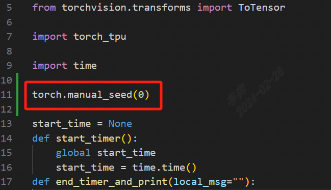
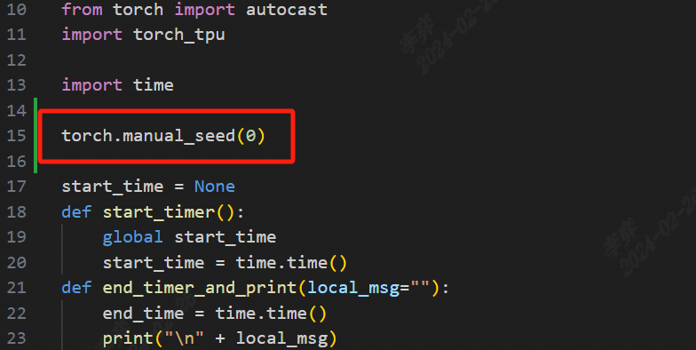
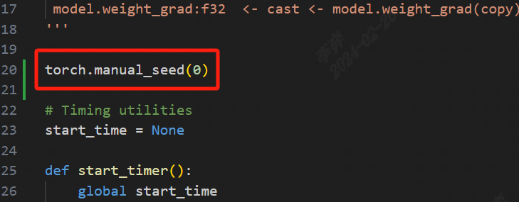

模型训练实例
============

本节使用 torch.nn 类来定义MNIST网络模型并介绍说明具体的训练流程。

本节分别给出不同精度（FP16、FP32、混合精度）下的训练代码示例以及训练结果说明，并设定迭代5个epoch。

本节默认使用者已经按照第2章说明完成torch-tpu环境配置安装。

项目示例代码可以从 torch-tpu*.whl包中的 torch_tpu/demo/mnist/ 获取。

通过以下命令可以直接解压whl包，即可获取到本章节示例代码：

.. code-block:: shell

    $ unzip torch-tpu*.whl

这里需要注意，由于硬件设备的状态不用，所以各项指标（推理时间、推理精度）的实际测试值会与文档给出的 log 日志有出入。用户可根据
以下标准来判定是否复现成功：

（1）针对 Accuracy 的复现结果：当数值与本手册所给出的 log 中对应数值相差不超过5%，且 Accuracy 数值在随着 epoch 增加而呈现上升趋势时，判定为复现成功。

（2）针对 Total execution time 的复现结果：该数值的实际复现结果会因为基于主机 CPU 状态不同而存在差异，不作为判断是否成功复现的依据。

模型训练_FP32
------------------

单精度浮点（FP32）提供了较高的数值精度，可以进行更精确的计算，减少了数值误差的累积，适用于对精度要求较高的应用。

高精度实现的同时也带来了更多的内存带宽和计算资源的占用，因此模型和数据集占用的内存空间也更大，而这也导致FP32虽然在计算速度上较慢，但是其训练精度高。

本示例是在默认的FP32精度下实现的模型训练。

为了保证复现结果与本手册结果一致，且用户更容易验证环境配置与训练过程复现是否成功，需要在运行前设置随机数种子：

.. code-block:: shell

            torch.manual_seed(0) 

修改后如图所示：

执行上述 mnist_fp32.py 文件，得到如下结果（此处只显示训练5个epoch的训练和验证数据）：

.. code-block:: shell

  """
  ===== log:
  Epoch 1
  -------------------------------
  loss: 2.305312  [   64/60000]
  loss: 2.298351  [ 6464/60000]
  loss: 2.277986  [12864/60000]
  loss: 2.275867  [19264/60000]
  loss: 2.254384  [25664/60000]
  loss: 2.230112  [32064/60000]
  loss: 2.230498  [38464/60000]
  loss: 2.198090  [44864/60000]
  loss: 2.203433  [51264/60000]
  loss: 2.172684  [57664/60000]
  Test Error: 
  Accuracy: 49.5%, Avg loss: 2.162513 

  Epoch 2
  ·····························
  Accuracy: 59.2%, Avg loss: 1.899496 
  Epoch 3
  ·····························
  Accuracy: 61.3%, Avg loss: 1.524535 
  Epoch 4
  ·····························
  Accuracy: 63.5%, Avg loss: 1.246983
  Epoch 5
  ·····························
  Accuracy: 64.9%, Avg loss: 1.076180
  Total execution time = 43.904 sec
  """

模型训练_FP16
------------------

半精度浮点（FP16）模式下，可以减少模型和数据集的内存占用，降低内存带宽要求，从而在支持 FP16 运算的硬件上，较于FP32模式取得加快计算速度，同时相较于FP32在训练精度方面也会有明显的下降。

本示例是在FP16精度下实现的模型训练。

在示例中，首先对网络模型进行初始化定义：

.. code-block:: shell

    class NeuralNetwork(nn.Module):
            def __init__(self):
                    super().__init__()
                    self.flatten = nn.Flatten()
                    self.linear_relu_stack = nn.Sequential(
                        nn.Linear(28*28, 512),
                        nn.ReLU(),
                        nn.Linear(512, 512),
                        nn.ReLU(),
                        nn.Linear(512, 10)
                    )

            def forward(self, x):
                    x = self.flatten(x)
                    logits = self.linear_relu_stack(x)
                    return logits
    model = NeuralNetwork().to(device)

随后，通过 model.half() 来将所有浮点参数和缓冲区转换为half数据类型，即FP16模式。

.. code-block:: shell

            model.half()    

项目示例代码可以从 torch-tpu*.whl包中的 torch_tpu/demo/mnist/mnist_fp16.py 获取。

为了保证复现结果与本手册结果一致，且用户更容易验证环境配置与训练过程复现是否成功，需要在运行前设置随机数种子：

.. code-block:: shell

            torch.manual_seed(0) 

修改后如图所示：

执行 mnist_fp16.py 文件，得到如下结果（此处只显示训练5个epoch的训练和验证数据）：

.. code-block:: shell

  """
  ===== log:
  Epoch 1
  -------------------------------
  loss: 2.304688  [   64/60000]
  loss: 2.306641  [ 6464/60000]
  loss: 2.300781  [12864/60000]
  loss: 2.304688  [19264/60000]
  loss: 2.296875  [25664/60000]
  loss: 2.287109  [32064/60000]
  loss: 2.287109  [38464/60000]
  loss: 2.275391  [44864/60000]
  loss: 2.289062  [51264/60000]
  loss: 2.285156  [57664/60000]
  Test Error: 
  Accuracy: 18.5%, Avg loss: 2.276759 
  
  Epoch 2
  ·····························
  Accuracy: 39.1%, Avg loss: 2.248383 
  Epoch 3
  ·····························
  Accuracy: 46.6%, Avg loss: 2.218551
  Epoch 4
  ·····························
  Accuracy: 46.3%, Avg loss: 2.184738 
  Epoch 5
  ·····························
  Accuracy: 46.9%, Avg loss: 2.144656 
  Total execution time = 37.058 sec
  """

模型训练_混合精度
------------------

自动混合精度(AMP)是一种优化训练过程的技术，它可以在保持模型精度的同时减少计算资源的使用。这是通过在训练过程中使用不同的数据类型（如float16和float32）来完成的。

混合精度模式结合使用 FP16 和 FP32。关键的权重、梯度和中间计算可以在 FP32 中进行以保持数值稳定性，而其他操作则可以使用 FP16 来加速计算和减少内存使用。

其可以在不牺牲太多精度的情况下加快训练速度和提高内存效率。它还可以允许更大的模型和批量大小在相同的硬件配置上运行。

本示例是在混合精度下实现的模型训练。

首先，我们初始化 GradScaler ， GradScaler 会帮助调整梯度的比例，防止在float16计算中出现梯度下溢。

.. code-block:: shell

    scaler = torch.tpu.amp.GradScaler()

然后，使用autocast上下文管理器。在训练循环中，将模型的前向传播过程包装在autocast上下文管理器中。这将临时将选定的操作转换为float16，以加速计算。

.. code-block:: shell

    with autocast(device_type = device, dtype = torch.float16):
            X, y = X.to(device, dtype=torch.float16), y.to(device)
            pred = model(X)
            loss = loss_fn(pred, y)

在计算 loss 时，调用scaler.scale()方法来缩放损失，然后进行反向传播。

.. code-block:: shell

    scaler.scale(loss.float()).backward()

权重更新阶段，使用 scaler.step() 替代 optimizer.step() 来更新权重，并通过 scaler.update() 来更新scaler的状态。

.. code-block:: shell

    scaler.step(optimizer)
    scaler.update()

最后，在每次迭代结束后清除模型的梯度。

.. code-block:: shell

    optimizer.zero_grad()

完整的项目示例代码可以从 torch-tpu*.whl包中获取。

（torch_tpu/demo/mnist/mnist_mix_precision.py ）

为了保证复现结果与本手册结果一致，且用户更容易验证环境配置与训练过程复现是否成功，需要在运行前设置随机数种子：

.. code-block:: shell

            torch.manual_seed(0) 

修改后如图所示：

执行上述 mnist_mix_precision.py 文件，得到如下结果（此处只显示训练5个epoch的训练和验证数据）：

.. code-block:: shell

  """
  Epoch 1
  -------------------------------
  loss: 2.304688  [   64/60000]
  loss: 2.298828  [ 6464/60000]
  loss: 2.277344  [12864/60000]
  loss: 2.275391  [19264/60000]
  loss: 2.253906  [25664/60000]
  loss: 2.230469  [32064/60000]
  loss: 2.230469  [38464/60000]
  loss: 2.199219  [44864/60000]
  loss: 2.203125  [51264/60000]
  loss: 2.173828  [57664/60000]
  Test Error: 
  Accuracy: 49.5%, Avg loss: 2.162669 

  Epoch 2
  ·····························
  Accuracy: 59.2%, Avg loss: 1.899893
  Epoch 3
  ·····························
  Accuracy: 61.2%, Avg loss: 1.525266 
  Epoch 4
  ·····························
  Accuracy: 63.5%, Avg loss: 1.247403
  Epoch 5
  ·····························
  Accuracy: 64.9%, Avg loss: 1.076614 
  Total execution time = 53.047 sec
  """

模型训练实例_YOLOV5S
===================

本章节介绍了如何在使用Torch-TPU的前提下，微调YOLOV5S的具体训练流程。

本节分别给出不同精度（FP16、FP32、混合精度）下的训练代码示例。

本节默认使用者已经按照第2章说明完成torch-tpu环境配置安装。

项目示例代码可以从 torch-tpu*.whl包中的 torch_tpu/demo/yolov5s/yolov5s 获取。(解压whl包即可看到)

安装必要环境，`pip3 install -r requirements.txt`

模型训练_FP32
------------------

本示例是在默认的FP32精度下实现的模型训练。

执行如下命令，即可开始fp32训练：

.. code-block :: bash

    python3 train_fp16.py --img 640 --epoch 3 --data coco128.yaml --weights yolov5s.pt --workers 1 --batch-size 2 --device tpu --optimizer SGD

注意命令会自动下载数据集和模型文件。

模型训练_FP16
------------------

本示例是在默认的FP16精度下实现的模型训练。

执行如下命令，即可开始fp16训练：

.. code-block :: bash

    python3 train_fp16.py --img 640 --epoch 3 --data coco128.yaml --weights yolov5s.pt --workers 1 --batch-size 2 --device tpu --optimizer SGD

注意命令会自动下载数据集和模型文件。
